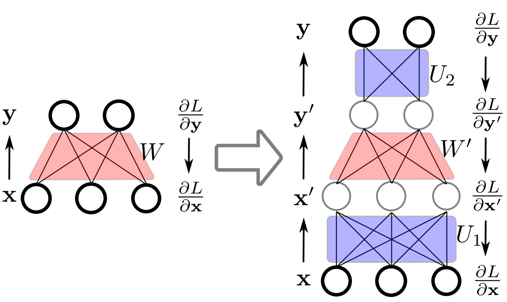

# Rotate your Networks: Better Weight Consolidation and Less Catastrophic Forgetting
The paper has been accepted as oral presentation in ICPR 2018. An [arXiv pre-print](https://arxiv.org/pdf/1802.02950v3.pdf) version is available. [Project page](http://www.lherranz.org/2018/08/21/rotating-networks-to-prevent-catastrophic-forgetting/) is available.

## Abstract
 In this paper we propose an approach to avoiding catastrophic
  forgetting in sequential task learning scenarios. Our technique is
  based on a network reparameterization that approximately
  diagonalizes the Fisher Information Matrix of the network
  parameters. This reparameterization takes the form of a factorized
  rotation of parameter space which, when used in conjunction with
  Elastic Weight Consolidation (which assumes a diagonal Fisher Information
  Matrix), leads to significantly better performance on lifelong
  learning of sequential tasks. Experimental results on the MNIST,
  CIFAR-100, CUB-200 and Stanford-40 datasets demonstrate that we
  significantly improve the results of standard elastic weight
  consolidation, and that we obtain competitive results when compared
  to the state-of-the-art in lifelong learning without
  forgetting.

## Requirements

The latest version of [Tensorflow](https://www.tensorflow.org/install/) and [Jupyter Notebook](http://jupyter.org/install).

## Demo on MNIST dataset

Run [Notebook](REWC_MNIST_LeNet.ipynb) with different settings.

## Demo on [CUB-200 Birds datasest](http://www.vision.caltech.edu/visipedia/CUB-200-2011.html).

Download the pre-trained ImageNet VGG-16 modeland put it in this [foleder](./nets).

Download the CUB-200 Birds dataset.

Change the data path in this [file](./Birds_vgg16/params.py).

Run [script](./Birds_vgg16) for both EWC and our appraoch R-EWC.

```
./Birds_vgg16/REWC_Birds_vgg16.sh
./Birds_vgg16/EWC_Birds_vgg16.sh
```

## Evaluation

We report the average accuracy as the evaluation metric. Note that all our experiments are based on single-head implementation. You could also test on multi-head setting by changing the test parameters.

## Useful functions

You could find useful functions on different datasets and networks [here](./utils).

## An example on fully connected layer



## Citation

Please cite our paper if you are inspired by the idea.

```
@inproceedings{xialei2018forgetting,
title={Rotate your Networks: Better Weight Consolidation and Less Catastrophic Forgetting},
author={Liu, Xialei and Masana, Marc and Herranz, Luis and Van de Weijer, Joost and Lopez, Antonio M and Bagdanov, Andrew D},
booktitle={International Conference on Pattern Recognition (ICPR)},
url = {https://github.com/xialeiliu/RotateNetworks},
year={2018}
}
```


